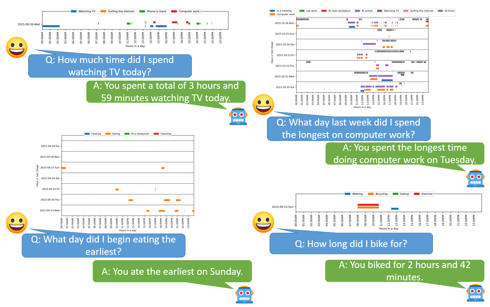

# SensorQA: LLMs Meets Wearable Device Data \[[Paper]()]
***




# Getting Started
***
The SensorQA Dataset is a dataset designed to train models to be able to understand wearable sensor reading and be able to answer questions about them.

To Download the annotation files:
    
    git clone https://github.com/[]/SensorQA/

Our dataset uses the sensor reading and features from the Extrasensory dataset. They can be found here: http://extrasensory.ucsd.edu/


# Reproducing Baselines
***
<table>
    <caption>Baselines - Conversational Dataset</caption>
    <thead>
        <tr>
            <th>Modalities</th>
            <th>Backbone Model</th>
            <th>ZS/FT</th>
            <th>Oracle</th>
            <th>Rouge-1</th>
            <th>Rouge-2</th>
            <th>Rouge-L</th>
            <th>Meteor</th>
            <th>Bleu</th>
            <th>Exact Match</th>
        </tr>
    </thead>
    <tbody>
        <tr>
            <td>L</td>
            <td>T5-Base</td>
            <td>FT</td>
            <td></td>
            <td>0.71</td>
            <td>0.55</td>
            <td>0.69</td>
            <td>0.70</td>
            <td>0.43</td>
            <td>0.26</td>
        </tr>
        <tr style="background-color: #f2f2f2;">
            <td>L</td>
            <td>Llama-7B-LORA</td>
            <td>FT</td>
            <td></td>
            <td>0.72</td>
            <td>0.62</td>
            <td>0.72</td>
            <td>0.72</td>
            <td>0.38</td>
            <td>0.04</td>
        </tr>
        <tr>
            <td>V+L</td>
            <td>Llama-7B-Adapter</td>
            <td>ZS</td>
            <td>✔</td>
            <td>0.33</td>
            <td>0.20</td>
            <td>0.30</td>
            <td>0.44</td>
            <td>0.09</td>
            <td>0</td>
        </tr>
        <tr style="background-color: #f2f2f2;">
            <td>V+L</td>
            <td>Llama-7B-Adapter</td>
            <td>FT</td>
            <td>✔</td>
            <td>0.73</td>
            <td>0.57</td>
            <td>0.71</td>
            <td>0.72</td>
            <td>0.43</td>
            <td>0.14</td>
        </tr>
        <tr>
            <td>V+L</td>
            <td>Llava-1.5-LORA</td>
            <td>FT</td>
            <td>✔</td>
            <td>0.62</td>
            <td>0.46</td>
            <td>0.60</td>
            <td>0.58</td>
            <td>0.35</td>
            <td>0.13</td>
        </tr>
        <tr style="background-color: #f2f2f2;">
            <td>V+L</td>
            <td>Llama-7B-Adapter</td>
            <td>ZS</td>
            <td>✘</td>
            <td>0.09</td>
            <td>0.42</td>
            <td>0.31</td>
            <td>0.19</td>
            <td>0.28</td>
            <td>0</td>
        </tr>
        <tr>
            <td>V+L</td>
            <td>Llama-7B-Adapter</td>
            <td>FT</td>
            <td>✘</td>
            <td>0.43</td>
            <td>0.72</td>
            <td>0.73</td>
            <td>0.57</td>
            <td>0.70</td>
            <td>0.14</td>
        </tr>
        <tr style="background-color: #f2f2f2;">
            <td>V+L</td>
            <td>Llava-1.5-LORA</td>
            <td>FT</td>
            <td>✘</td>
            <td>0.64</td>
            <td>0.47</td>
            <td>0.61</td>
            <td>0.60</td>
            <td>0.35</td>
            <td>0.11</td>
        </tr>
        <tr>
            <td>S+L</td>
            <td>Llama-7B-Adapter-HC</td>
            <td>FT</td>
            <td></td>
            <td>0.72</td>
            <td>0.55</td>
            <td>0.70</td>
            <td>0.71</td>
            <td>0.42</td>
            <td>0.14</td>
        </tr>
        <tr style="background-color: #f2f2f2;">
            <td>S+L</td>
            <td>Llama-7B-Adapter-CLIP</td>
            <td>FT</td>
            <td></td>
            <td>0.71</td>
            <td>0.53</td>
            <td>0.69</td>
            <td>0.69</td>
            <td>0.40</td>
            <td>0.12</td>
        </tr>
    </tbody>
</table>

<table>
    <caption>Baselines - Exact Match</caption>
    <thead>
        <tr>
            <th>Modalities</th>
            <th>Backbone Model</th>
            <th>ZS/FT</th>
            <th>Oracle</th>
            <th>Accuracy</th>
        </tr>
    </thead>
    <tbody>
        <tr>
            <td>L</td>
            <td>T5-Base</td>
            <td>FT</td>
            <td></td>
            <td>25.4%</td>
        </tr>
        <tr style="background-color: #f2f2f2;">
            <td>L</td>
            <td>Llama-7B-LORA</td>
            <td>FT</td>
            <td></td>
            <td>26.5%</td>
        </tr>
        <tr>
            <td>V+L</td>
            <td>Llama-7B-Adapter</td>
            <td>ZS</td>
            <td>✔</td>
            <td>0%</td>
        </tr>
        <tr style="background-color: #f2f2f2;">
            <td>V+L</td>
            <td>Llama-7B-Adapter</td>
            <td>FT</td>
            <td>✔</td>
            <td>28%</td>
        </tr>
        <tr>
            <td>V+L</td>
            <td>Llava-1.5-LORA</td>
            <td>FT</td>
            <td>✔</td>
            <td>21.5%</td>
        </tr>
        <tr style="background-color: #f2f2f2;">
            <td>V+L</td>
            <td>Llama-7B-Adapter</td>
            <td>ZS</td>
            <td>✘</td>
            <td>0%</td>
        </tr>
        <tr>
            <td>V+L</td>
            <td>Llama-7B-Adapter</td>
            <td>FT</td>
            <td>✘</td>
            <td>26.2%</td>
        </tr>
        <tr style="background-color: #f2f2f2;">
            <td>V+L</td>
            <td>Llava-1.5-LORA</td>
            <td>FT</td>
            <td>✘</td>
            <td>11%</td>
        </tr>
        <tr>
            <td>S+L</td>
            <td>Llama-7B-Adapter-CLIP</td>
            <td>FT</td>
            <td></td>
            <td>23.5%</td>
        </tr>
        <tr style="background-color: #f2f2f2;">
            <td>S+L</td>
            <td>Llama-7B-Adapter</td>
            <td>FT</td>
            <td></td>
            <td>24.8%</td>
        </tr>
        <tr>
            <td>S+L</td>
            <td>DeepSQA</td>
            <td>FT</td>
            <td></td>
            <td>27.46%</td>
        </tr>
    </tbody>
</table>


To reproduce the T5 baseline:

    python question_only.py
    python t5_text_evaluation

To reproduce the LLama-7B-LORA experiment:

    python llama_lora_training.py --train
    python llama_lora_training.py --eval
    python llama_text_evaluation.py

To reproduce the Llama-7B-Adapter fine-tuning for vision+language adjust the configs in `Llama-Adapter/llama_adapter_v2_multimodal7b/exps/finetune-data-config.yaml` to the desired file you want to train on.

You will need the llama weights and the adapter weights.

For further instructions on how to use their library: https://github.com/OpenGVLab/LLaMA-Adapter/blob/main/llama_adapter_v2_multimodal7b/docs/train.md

Then do the following:

    cd LLaMA-Adapter/llama_adapter_v2_multimodal7b 
    ./exps/finetune.sh models/llama LLaMA-Adapter/ckpts/7fa55208379faf2dd862565284101b0e4a2a72114d6490a95e432cf9d9b6c813_BIAS-7B.pth exps/finetune-data-config.yaml outputs ./exps/finetune.sh models/llama LLaMA-Adapter/ckpts/d26d107eec32127ac86ef1997cf7169de1c56a59c539fc1258c6798b969e289c_LORA-BIAS-7B-v21.pth exps/finetune-data-config.yaml outputs
    python llama_adapter_val_loop.py
    python llama_text_evaluation.py

To reproduce the Llava-1.5-LORA results:

    accelerate launch --mixed_precision fp16 llama_lora_train.py --dataset_name="HuggingFaceH4/llava-instruct-mix-vsft"     --model_name_or_path="llava-hf/llava-1.5-7b-hf"     --report_to="none"     --learning_rate=2e-5     --per_device_train_batch_size=1     --gradient_accumulation_steps=1     --output_dir="data/vsft-llava-1.5-7b-hf"     --num_train_epochs=4     --gradient_checkpointing     --remove_unused_columns=False     --torch_dtype=float16 --fp16=True  --use_peft=True     --lora_r=64     --lora_alpha=16     --lora_target_modules=all-linear --log_level="info" --logging_strategy="steps" --logging_steps=1
    python sensorqa_llava_eval.py

Most of these parameters are hard-coded in the code itself, so if you want to change them, change them there.

To reproduce the Llama-7B-Adapter S+L handcrafted feature results, you will first need to download the handcrafted features from: http://extrasensory.ucsd.edu/data/primary_data_files/ExtraSensory.per_uuid_features_labels.zip

Then to train the Llama-7B-Adapter S+L we first need to install a custom version of timm (included in this repository). This custom version allows for attention-masks in vision models. This helps mask the padding needed when processing sensor features.

To do this custom install:

    cd pytorch-image-models
    pip install -e .

Then to train:

    cd LLaMA-Adapter/llama_adapter_v2_multimodal7b_sensors 
    ./exps/finetune.sh models/llama LLaMA-Adapter/ckpts/7fa55208379faf2dd862565284101b0e4a2a72114d6490a95e432cf9d9b6c813_BIAS-7B.pth exps/finetune-data-config.yaml outputs ./exps/finetune.sh models/llama LLaMA-Adapter/ckpts/d26d107eec32127ac86ef1997cf7169de1c56a59c539fc1258c6798b969e289c_LORA-BIAS-7B-v21.pth exps/finetune-data-config-sensors.yaml outputs
    python llama_adapter_sensors_val_loop.py
    python llama_text_evaluation.py

For the Llama-7B-Adapter S+L with CLIP features, we start with the raw time series data of ExtraSensory (Accelerometer, Gyroscope, Magnetometer, Watch Accelerator and Audio MFCC features), which can be downloaded from their official website, such as http://extrasensory.ucsd.edu/data/raw_measurements/ExtraSensory.raw_measurements.raw_acc.zip. To train:

```bash
cd clip_training
./run.sh
```

Then once you have the CLIP features:

    cd LLaMA-Adapter/llama_adapter_v2_multimodal7b_sensors_clip 
    ./exps/finetune.sh models/llama LLaMA-Adapter/ckpts/7fa55208379faf2dd862565284101b0e4a2a72114d6490a95e432cf9d9b6c813_BIAS-7B.pth exps/finetune-data-config.yaml outputs ./exps/finetune.sh models/llama LLaMA-Adapter/ckpts/d26d107eec32127ac86ef1997cf7169de1c56a59c539fc1258c6798b969e289c_LORA-BIAS-7B-v21.pth exps/finetune-data-config-sensors.yaml outputs
    python llama_adapter_sensors_val_loop.py
    python llama_text_evaluation.py

For the DeepSQA model, we adapt our code from the [DeepSQA repo](https://github.com/nesl/DeepSQA). To train:

```bash
cd DeepSQA
python3 deepsqa_ca.py --gpt_shortened
```

